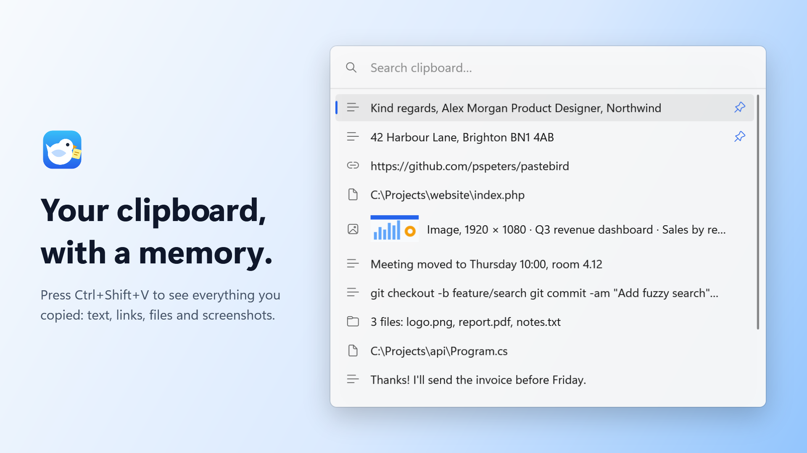
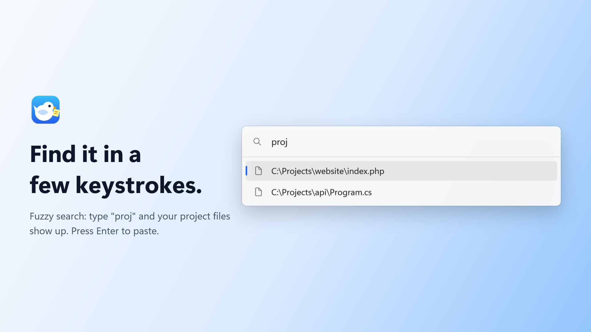
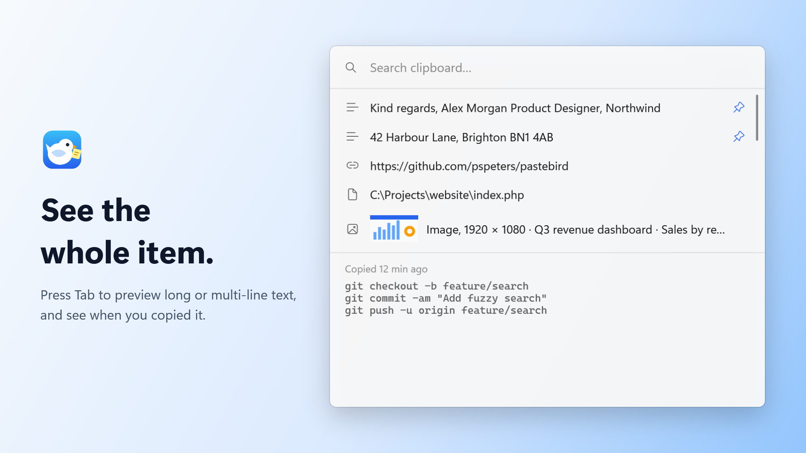
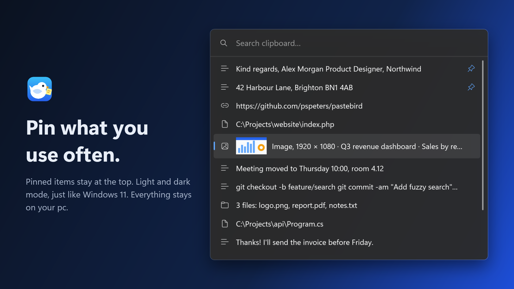

# Pastebird

A dead-simple, fast clipboard manager for Windows 11.

**Ctrl+C → later Ctrl+Shift+V → type → Enter → done.**

Pastebird runs quietly in the system tray and remembers what you copy: text (with its formatting), URLs, file paths, copied files and images. One shortcut opens a small popup where you search and paste.

<table>
  <tr>
    <td></td>
    <td></td>
    <td></td>
  </tr>
  <tr>
    <td align="center">Fuzzy search</td>
    <td align="center">Preview with <code>Tab</code></td>
    <td align="center">Pinned items, dark mode</td>
  </tr>
</table>

- No main window, no toolbar, no clutter.
- Keyboard-first: everything works without a mouse.
- Native Windows 11 look with acrylic, rounded corners and light/dark mode.
- 100% local: no account, no cloud, no telemetry. The only network request is a daily update check with GitHub.
- Available in English and Dutch.

## Download

- **Microsoft Store (recommended):** [get Pastebird from the Microsoft Store](https://apps.microsoft.com/detail/9NS7S1NGXWTG). It installs without a Windows warning and the Store keeps it up to date.
- **Or the installer:** get the latest `PastebirdSetup-<version>.exe` from the [Releases](https://github.com/pspeters/pastebird/releases/latest) page and run it. Windows may show "Windows protected your PC" because the installer isn't code-signed yet: click **More info → Run anyway**.

Install just one of them. See the [changelog](CHANGELOG.md) for what's new.

- Requires Windows 11. No admin rights and no extra software needed.
- Pastebird starts right after installation and lives in the system tray (bottom right, next to the clock).
- Uninstall through Settings → Apps. This also removes your stored history.

## Usage

| Key | Action |
|---|---|
| `Ctrl + Shift + V` | Open Pastebird (press again to close) |
| type | Fuzzy search (`proj` finds `C:\Projects\website\index.php`) |
| `↑` / `↓`, `PgUp` / `PgDn` | Navigate |
| `Enter` | Put the item on the clipboard and paste it into the previous window |
| `Shift + Enter` | Copy only, don't paste |
| `Ctrl + Enter` | Paste as plain text, without formatting; for an image, the text in it (with `Shift`: copy only) |
| `Ctrl + 1` … `Ctrl + 9` | Paste the 1st to 9th item right away (with `Shift`: copy only) |
| `Tab` | Show or hide the full content (or image) of the selected item and when you copied it |
| `Ctrl + P` | Pin or unpin the selected item |
| `Delete` | Remove the selected item (when the cursor is at the end of the search box) |
| `Ctrl + Delete` | Clear the history (pinned items stay) |
| `Ctrl + Z` | Bring back what you just removed (while the popup is open) |
| `Esc` | Close |

- **Click the tray icon** to open the popup next to the icon. **Right-click** for Open Pastebird · Clear history · Settings · Exit.
- Copying or choosing an item again moves it to the top. Pastebird never stores duplicates.
- **Pin** items you use often, like a signature or address, with `Ctrl + P` or the pin icon that appears when you hover over an item. Pinned items stay at the top, don't count towards the history size and survive clearing the history.
- **Remove** an item with `Delete` or the trash icon that appears when you hover over it. Removed by mistake? Press `Ctrl + Z` before you close the popup.
- Copied files are restored as real files, so pasting in Explorer works, and also as text (the path).
- Text keeps its formatting (bold, links, tables) when you copied it from Word, Outlook or a web page. `Ctrl + Enter` pastes it as plain text.
- Images, like screenshots (`Win + Shift + S`) or pictures copied in a browser, show up with a small thumbnail. Press `Tab` to see them larger. Pastebird keeps the 50 most recent images (pinned ones don't count).
- **Search in screenshots**: Pastebird reads the text in copied images with the text recognition built into Windows, on your pc and without internet. Type a word that is in a screenshot to find it, or press `Ctrl + Enter` to paste its text. This needs text recognition for your language in Windows (Settings → Time & language → Language & region → your language → Language options → Optical character recognition).

## Settings

Pastebird works out of the box, so you shouldn't need Settings. They cover:

- **Start with Windows** (on by default)
- **Paste automatically** (on by default)
- **Check for updates automatically** (on by default)
- **Shortcut** (default `Ctrl + Shift + V`)
- **History size**: 50, 100, 200 or 500 items (default 200)
- **Remove old items**: never (default), or after 1, 7 or 30 days. Pinned items stay.
- **Language**: system default, English or Dutch
- **Clear history**

## Updates

Pastebird checks GitHub once a day for a new version. When there is one, a notification appears: click it, or choose **Update to version …** in the tray menu or **Update now** in Settings. Pastebird downloads the new installer, checks it against the checksum GitHub publishes, installs it and restarts by itself. Your history and settings stay. After the restart, a notification lets you know the update worked; click it to see what's new.

You can turn the check off in Settings. The Microsoft Store version is updated by the Store.

## Good to know

- **Ctrl+Shift+V in other apps.** In some programs (Chrome, Word, Teams) `Ctrl+Shift+V` means "paste without formatting". Pastebird takes over this shortcut system-wide. You can choose a different shortcut in Settings.
- **Automatic paste.** After you press Enter, Pastebird pastes into the window you were working in. Windows doesn't allow this in programs running as administrator. There the item is still on the clipboard, so just press `Ctrl+V`.

## Privacy

- Everything stays in `%LOCALAPPDATA%\Pastebird` on your pc: no accounts, telemetry or cloud.
- The only network request is the daily update check: Pastebird asks GitHub for the latest release and, when you choose to update, downloads the installer. Nothing about you or your clipboard is sent. GitHub sees your IP address, as with any website. You can turn the check off in Settings.
- Your history, including images and formatting, is encrypted for your Windows user account. Other accounts and other pcs can't read it.
- Content that password managers mark as private is never stored.
- Very large items (over 200,000 characters) are skipped, and the history size is capped.

## Support

Pastebird is free and open source. If it saves you time, you can [buy me a coffee](https://ko-fi.com/pastebirdapp) ☕

Found a bug or have an idea? [Open an issue](https://github.com/pspeters/pastebird/issues).

## License

MIT, see [LICENSE](LICENSE). Created by Patrick Speters.

Building from source: see [docs/BUILDING.md](docs/BUILDING.md).
